Below is the **full product flow diagram** for the laundry service platform. It integrates all personas and operational flows defined in your validated user story canvas (customer → worker → driver → admin operations) .

This diagram is designed so engineering teams can understand:

- lifecycle of an order
- system triggers
- actor responsibilities
- backend transitions
- failure paths

---

# Full Product Flow Diagram

```mermaid
flowchart TD

%% CUSTOMER START

A[Customer Opens App] --> B{Account Exists?}

B -- No --> C[Register / Sign Up]
B -- Yes --> D[Login]

C --> D

D --> E[Create Laundry Order]

E --> F[Enter Laundry Details]
F --> G[Select Number of Loads]
G --> H[Add Special Instructions]

H --> I{Pickup or Self Drop-Off}

%% DROP-OFF PATH
I -- Self Drop-Off --> J[Choose Drop-Off Time Slot]
J --> K[Confirm Order]

%% PICKUP PATH
I -- Pickup Service --> L[Choose Pickup Time Slot]
L --> K

%% PAYMENT

K --> M[Show Order Summary]
M --> N[Proceed to Payment]

N --> O[Stripe Checkout]

O --> P{Payment Success?}

P -- No --> Q[Payment Failed]
Q --> N

P -- Yes --> R[Order Confirmed]

%% ORDER CREATED

R --> S[Reserve Time Slot Capacity]
S --> T[Create Order Record]

%% PICKUP / DROP-OFF

T --> U{Service Type}

U -- Self Drop-Off --> V[Customer Drops Laundry at Shop]
U -- Pickup --> W[Driver Assigned Pickup Task]

W --> X[Driver Collects Laundry]
X --> Y[Mark Pickup Complete]

V --> Z[Laundry Received at Shop]
Y --> Z

%% PROCESSING

Z --> AA[Assign Laundry Worker]

AA --> AB[Start Washing]
AB --> AC[Finish Washing]

AC --> AD[Start Drying]
AD --> AE[Finish Drying]

AE --> AF[Start Folding]
AF --> AG[Finish Folding]

%% ISSUE CHECK

AG --> AH{Laundry Issue?}

AH -- Yes --> AI[Create Issue Report]
AI --> AJ[Admin Review]
AJ --> AK[Resolve Issue]
AK --> AL[Resume Processing]

AH -- No --> AM[Ready For Delivery]

AL --> AM

%% DELIVERY

AM --> AN[Assign Delivery Task]

AN --> AO[Driver Receives Delivery Job]

AO --> AP[Driver Travels to Building]

AP --> AQ[Deliver to Lobby / Security Desk]

AQ --> AR[Capture Delivery Proof]

AR --> AS[Mark Delivery Complete]

%% COMPLETION

AS --> AT[Order Status = Completed]

AT --> AU[Customer Notification Sent]

AU --> AV[Customer Receives Laundry]

%% ADMIN OPERATIONS

subgraph Admin Operations

BA[Admin Dashboard]

BA --> BB[View Orders]
BA --> BC[View Worker Queue]
BA --> BD[View Driver Tasks]
BA --> BE[Manage Time Slots]
BA --> BF[Update Pricing]
BA --> BG[View Analytics]

end
```



---

# Explanation of Major Flow Segments

## 1. Customer Order Creation

The order starts with:

```
Customer → Order Creation → Slot Selection → Payment
```

Critical backend actions:

- create draft order
- reserve slot capacity
- create Stripe checkout session
- confirm payment via webhook

---

## 2. Slot Capacity Reservation

When order is confirmed:

```
remainingLoads >= order.loadCount
```

If not:

```
slot booking rejected
```

This enforces machine capacity.

---

## 3. Laundry Processing

Workers interact with a **task queue**.

Processing stages:

```
received_at_shop
washing
drying
folding
ready_for_delivery
```

Workers update these statuses.

---

## 4. Issue Handling

If workers encounter issues:

Example:

```
damaged clothing
missing items
machine malfunction
```

Flow:

```
worker report → admin review → resolution → resume processing
```

---

## 5. Delivery Workflow

Driver flow:

```
delivery task assigned
↓
driver route navigation
↓
arrive building
↓
deliver to lobby/security desk
↓
capture delivery proof
↓
mark delivery complete
```

Important constraint:

```
Doorstep delivery NOT allowed
```

This aligns with the security restrictions defined in the system requirements .

---

# Operational Views in System

## Customer Interface

Customer sees:

```
Orders
Status timeline
Delivery schedule
Payment history
Notifications
```

---

## Laundry Worker Interface

Workers see:

```
Assigned laundry queue
Order details
Processing steps
Issue reporting
```

---

## Delivery Worker Interface

Drivers see:

```
Pickup tasks
Delivery tasks
Address instructions
Navigation link
Proof-of-delivery upload
```

---

## Admin Dashboard

Admins control:

```
Orders
Workers
Drivers
Slot capacity
Pricing
Analytics
```

---

# System Events Timeline

Each order produces system events.

```
OrderPlaced
PaymentConfirmed
LaundryReceived
WashStarted
WashCompleted
DryCompleted
FoldCompleted
DeliveryAssigned
OutForDelivery
Delivered
OrderCompleted
```

These events trigger:

```
notifications
analytics
status history
```

---

# Backend Trigger Points

## Payment

Stripe webhook triggers:

```
update payment status
update order status
reserve slot
send confirmation
```

---

## Laundry Processing

Worker updates trigger:

```
order status change
status history log
customer notification
```

---

## Delivery

Driver confirmation triggers:

```
delivery proof upload
order completion
customer notification
```

---

# Failure Paths Covered

### Payment Failure

```
retry checkout
```

### Slot Full

```
choose another slot
```

### Laundry Issue

```
pause order
admin intervention
```

### Delivery Access Problem

```
driver incident report
admin contact customer
```

---

# What This Diagram Enables

This artifact allows engineering teams to:

- implement workflow services
- design backend mutations
- build UI screens per role
- define event triggers
- validate operational correctness

---
