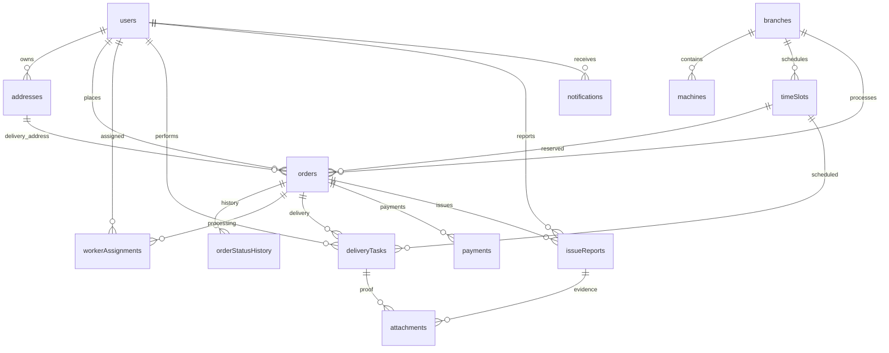
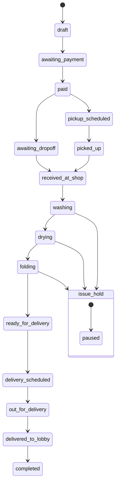

This document contain three things:

1. **ERD (Entity Relationship Diagram)**
2. **Order lifecycle state machine**
3. **Convex module architecture layout**

All of these map directly to the confirmed user stories and constraints (customer order → wash → dry → fold → deliver to lobby/security desk) .

---

# 1. Domain ERD (Mermaid)

This diagram shows the **core data relationships**.



---

# 2. Domain entity explanation

## Users

Represents:

- customers
- laundry workers
- delivery drivers
- admins

Key relationship:

```
users
 ├── addresses
 ├── orders
 ├── workerAssignments
 ├── deliveryTasks
```

---

## Orders (Aggregate Root)

All workflows revolve around **orders**.

```
order
 ├── payments
 ├── statusHistory
 ├── deliveryTasks
 ├── workerAssignments
 ├── issues
```

This design ensures:

- a single source of truth
- easier state transitions
- clean operational dashboards

---

## TimeSlots

Slots represent **capacity windows**.

They are used for:

- pickup
- drop-off
- delivery

Capacity model:

```
capacityLoads
reservedLoads
remainingLoads
```

This allows correct scheduling because pricing is **per washing machine load**.

---

## DeliveryTasks

Operational unit for drivers.

Two common types:

```
pickup
delivery
```

Separate entity ensures:

- driver queues
- route planning
- proof-of-delivery

---

## WorkerAssignments

Operational unit for laundry workers.

Separates processing responsibility from order itself.

---

## Payments

Stripe mirror record.

Contains:

```
stripeCheckoutSession
paymentIntent
chargeId
status
```

Stripe webhook updates these records.

---

## IssueReports

Operational exception handling.

Example cases:

- garment damage
- machine problem
- missing item
- delivery access issue

---

## Attachments

Used for:

- proof of delivery photos
- damaged item photos
- issue evidence

Stored using Convex file storage.

---

# 3. Order lifecycle state machine

This is critical for system correctness.



Key rule:

```
final delivery state = delivered_to_lobby
```

because doorstep delivery is not allowed .

---

# 4. Convex module architecture

Recommended backend folder structure.

```
convex/

schema.ts

auth/
  clerk.ts
  guards.ts

users/
  queries.ts
  mutations.ts

addresses/
  queries.ts
  mutations.ts

slots/
  queries.ts
  mutations.ts
  capacity.ts

orders/
  queries.ts
  mutations.ts
  stateMachine.ts

workers/
  queries.ts
  mutations.ts
  queue.ts

deliveries/
  queries.ts
  mutations.ts
  routing.ts

payments/
  stripe.ts
  webhooks.ts
  queries.ts

issues/
  queries.ts
  mutations.ts

files/
  upload.ts
  queries.ts

notifications/
  email.ts
  scheduler.ts

analytics/
  queries.ts
  rollups.ts
```

---

# 5. Key backend services

## Order state machine

All status transitions should go through:

```
orders/stateMachine.ts
```

Example:

```
transitionOrder(orderId, targetState)
```

Validates:

- allowed transition
- role permission
- timestamp update
- status history entry

---

## Slot reservation engine

```
slots/capacity.ts
```

Rules:

```
if remainingLoads < order.loadCount
   reject booking
else
   reserve loads
```

---

## Stripe webhook processor

```
payments/webhooks.ts
```

Handles:

```
checkout.session.completed
payment_intent.succeeded
payment_intent.payment_failed
charge.refunded
```

Updates:

```
payments
orders.paymentStatus
order status
```

---

# 6. Query models (frontend views)

These queries power UI screens.

### Customer

```
getCustomerOrders
getOrderDetail
getAvailableSlots
getPaymentHistory
getAddresses
```

---

### Worker

```
getWorkerQueue
getOrderProcessingDetail
getReportedIssues
```

---

### Driver

```
getDriverTasks
getTaskDetail
getRouteTasksBySlot
```

---

### Admin

```
getOrdersByStatus
getSlotCapacity
getDailyRevenue
getWorkerAssignments
getDeliveryPerformance
```

---

# 7. Event timeline model

Each order generates events:

```
OrderPlaced
PaymentConfirmed
LaundryReceived
WashStarted
WashCompleted
DryCompleted
FoldCompleted
DeliveryScheduled
OutForDelivery
Delivered
OrderCompleted
```

These events feed:

- notifications
- analytics
- status history

---

# 8. Engineering invariants

Must always hold true.

### Payment

```
order cannot move to "paid"
unless Stripe webhook confirms payment
```

---

### Scheduling

```
reservedLoads <= capacityLoads
```

---

### Delivery

```
only driver role can complete delivery
```

---

### Processing

```
only worker role can update wash/dry/fold
```

---

# 9. Future scalability hooks

Designed for expansion.

Possible future features:

- multiple laundry branches
- dynamic pricing
- subscription laundry plans
- driver route optimization
- customer loyalty credits
- locker-based dropoff

All supported by current model.

---
